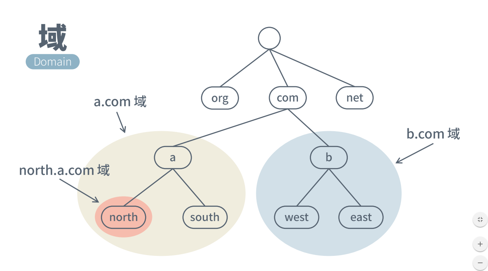
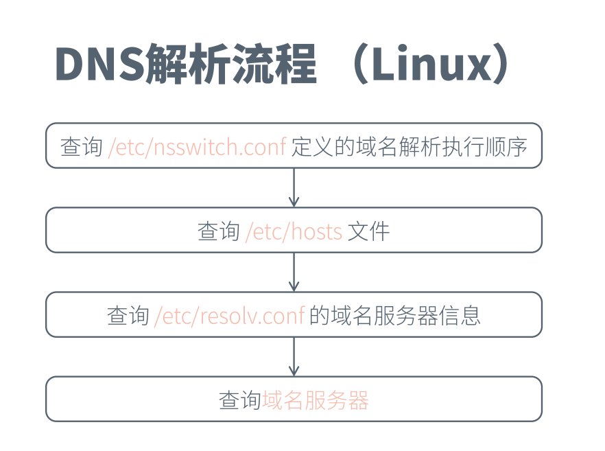
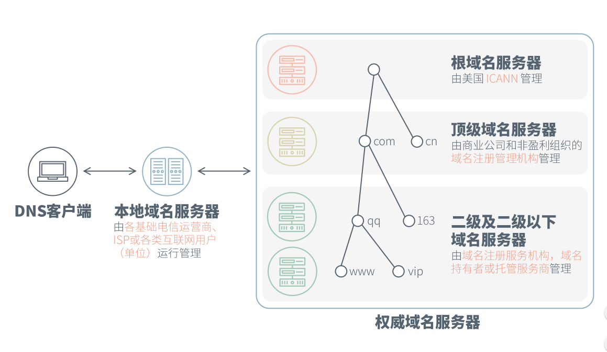

[TOC]

## DNS域名解析流程介绍  

​	互联网是基于TCP/IP协议的,而TCP/IP协议又是基于Ip地址的，所以我们所有的请求都要知道确定的IP地址，但是由于IP地址这种数字组成的字符串是比较难记忆的，所以有了域名这个东西。我们通过DNS解析系统,可以将具体域名解析成我们想要的IP地址。这就是DNS系统的作用。   

####  域名空间  

​	域名空间是一个树形结构。一般我们在浏览器输入一个域名提交后，浏览器都会在最后自动给我们加上一个点,形成一个FQDN(完整域名)。比如输入www.baidu.com，那么提交的域名其实是www.baidu.com. 。之后将域名以.为分割符拆开,从最后往前依次解析。比如www.baidu.com.，拆完后就是从.com开始解析,然后再去找.baidu.com，最后才找到www.baidu.com。

​	域名空间示例:

#### 解析过程   

1. 浏览器输入一个域名后,会去自己的缓存中查看有没有这个域名的解析结果,如果有就直接返回结果,解析过程结束。
2. 如果浏览器缓存中没有对应数据,那么会到本机上的hosts进行查询,如果本地有配hosts解析就直接返回解析出来的主机名,解析过程结束(**window上面C:\Windows\System32\drivers\etc\hosts,linux上面是/etc/hosts**)
3. 如果前面两个都获取不到解析结果,那么系统会去本机配的DNS解析服务器地址查找结果，我们简称LocalDNS。LocalDNS也会缓存解析结果，如果缓存中有对应的数据，那么直接返回结果，解析结束。这个LocalDNS解析服务器一般是本地互联网的运营商提供的地址，地址在网络配置中可以配置,如果没有配置一般会自动获取运营商对应的DNS服务器地址。比如说你用的是移动网,那么这个LocalDNS就是移动提供的一个DNS解析服务器。一般这个服务器就在你所在城市的某个角落。如果你用的是校园网,那么LocalDNS就是学校提供的DNS解析服务器,这个服务器一般位于学校的某个角落。  
4. 如果LocalDNS的缓存中也没有对应的数据,那么系统会去根域名服务器请求解析,根域名服务器全球只有固定的13台(**确切的说是13个IP**),dns服务器有个配置会存放这些根服务器的ip。根域名服务器给LocalDNS返回一个主域名服务器地址(gTLD Server)。gTLD是国际顶级域名服务器，如.com、.cn、.org。  
5. LocalDNS根据返回的主域名服务器地址，继续去这个地址查询.baidu.com这个域名空间的解析结果。如果找到了.baidu.com这个域名空间对应的Name Server域名服务器的地址,就将该地址返回给LocalDNS(**比如.baidu.com这个域名空间被授权给了百度公司,那百度公司会为.baidu.com的域名解析搭一个域名解析服务器**)。
6. LocalDNS根据返回回来的NameServer域名服务器地址去查找www.baidu.com这个域名的解析结果,该NameServer域名服务器中如果有这个域名的解析记录,就返回具体的主机ip给LocalDNS。  
7. LocalDNS根据返回回来的Ip和TTL(Time To Live)值，会缓存这个域名和IP的对应关系,缓存时间根据TTL值来控制。  
8. LocalDNS把解析结果返回给用户,用户也根据TTL值进行缓存,并得到域名解析的ip。

**流程图**:  

#### 几种域名解析方式  

域名解析记录主要分为A记录、MX记录、CNAME记录、NS记录和TXT记录：

1、A记录

A代表Address，用来指定域名对应的IP地址，如将item.taobao.com指定到115.238.23.xxx，将switch.taobao.com指定到121.14.24.xxx。**A记录可以将多个域名解析到一个IP地址，但是不能将一个域名解析到多个IP地址**

2、MX记录

Mail Exchange，就是可以将某个域名下的邮件服务器指向自己的Mail Server，如taobao.com域名的A记录IP地址是115.238.25.xxx，如果将MX记录设置为115.238.25.xxx，即xxx@taobao.com的邮件路由，DNS会将邮件发送到115.238.25.xxx所在的服务器，而正常通过Web请求的话仍然解析到A记录的IP地址

3、CNAME记录

Canonical Name，即别名解析。所谓别名解析就是可以为一个域名设置一个或者多个别名，如将aaa.com解析到bbb.net、将ccc.com也解析到bbb.net，其中bbb.net分别是aaa.com和ccc.com的别名

4、NS记录

为某个域名指定DNS解析服务器，也就是这个域名由指定的IP地址的DNS服务器取解析

5、TXT记录

为某个主机名或域名设置说明，如可以为ddd.net设置TXT记录为"这是XXX的博客"这样的说明  

#### 两种查询方式

1. 迭代查询:LocalDNS服务器只告诉客户机另外一台DNS服务器的地址,让客户机自己去循环查询结果。

2. 递归查询:委托给LocalDNS服务器去查询，LocalDNS服务器直接返回结果给客户机，即上面介绍的查询方法。一般DNS解析都是用递归查询的方法。   

@yangjb 2016.11.14