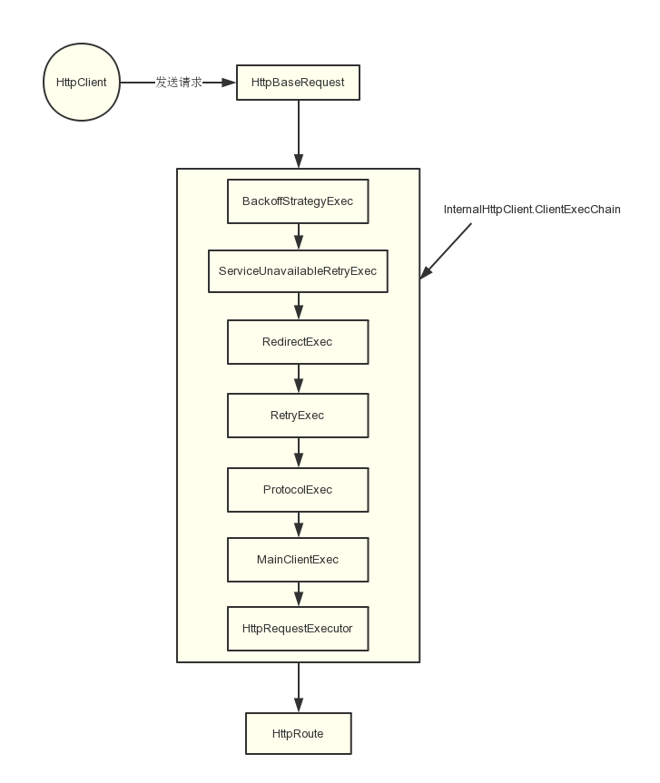

本篇重点介绍httpclient连接池的相关原理以及介绍，顺带的介绍httpclient发送请求时的简单介绍，并会带上一些源码分析。`本篇博文是基于httpclient的4.5.2版本进行介绍的`。

## 一、发送请求的流程原理 

### 几个关键的类和接口介绍

在介绍架构原理前，先介绍几个类和接口，方便读者对httpclient的整体设计有个大概的概念。

**HttpClient**：一个接口，即http客户端的抽象，主要就是用它发送请求http请求。它的主要实现有`CloseableHttpClient`，相信读者们比较熟悉。

**HttpRequestBase**：一个抽象类，是请求内容的抽象。包括了请求协议、uri、还有一些配置。我们常用的HttpGet和HttpPost都是它的子类。

**HttpClientConnectionManager**：一个接口，连接管理的抽象。一般要发送http请求前，需要和目标服务建立连接，然后再发送数据包。这个连接管理器可以对连接以池的方式进行管理。

**HttpRoute**：一个final类，用来表示目标服务器（ip+端口）。

### 发送流程图 



一个HttpRequestBase在被httpclient执行后，会经过一个链路被一个个组件处理。这里使用了职责链的设计模式，一个组件处理完后，就会交给下一个组件处理。这样做的好处就是如果要移除一个组件或者添加一个新的组件来实现对请求的一些处理非常方便。**这里要说一下，上图列的组件中的一些是根据配置决定是否加入到该执行链中。**

我们一般通过`CloseableHttpClient httpClient = HttpClients.custom().build();`获取到一个httpClient。这里返回的实际对象其实是`InternalHttpClient`类，所以执行`httpclient.execute(request)`时候最终会调用`InternalHttpClient#doExecute()`。我们看下对应的源码 

```java
protected CloseableHttpResponse doExecute(
            final HttpHost target,
            final HttpRequest request,
            final HttpContext context) throws IOException, ClientProtocolException {
        Args.notNull(request, "HTTP request");
        HttpExecutionAware execAware = null;
        if (request instanceof HttpExecutionAware) {
            execAware = (HttpExecutionAware) request;
        }
        try {
            final HttpRequestWrapper wrapper = HttpRequestWrapper.wrap(request, target);
            final HttpClientContext localcontext = HttpClientContext.adapt(
                    context != null ? context : new BasicHttpContext());
            RequestConfig config = null;
            if (request instanceof Configurable) {
                config = ((Configurable) request).getConfig();
            }
            if (config == null) {
                final HttpParams params = request.getParams();
                if (params instanceof HttpParamsNames) {
                    if (!((HttpParamsNames) params).getNames().isEmpty()) {
                        config = HttpClientParamConfig.getRequestConfig(params);
                    }
                } else {
                    config = HttpClientParamConfig.getRequestConfig(params);
                }
            }
            if (config != null) {
                localcontext.setRequestConfig(config);
            }
            setupContext(localcontext);
            final HttpRoute route = determineRoute(target, wrapper, localcontext);
            return this.execChain.execute(route, wrapper, localcontext, execAware);
        } catch (final HttpException httpException) {
            throw new ClientProtocolException(httpException);
        }
    }
```

通过代码可以看到，这里主要是做两件事

1. 获取requestConfig，然后设置到请求上下文中
2. 通过请求获取对应的目标服务器HttpRoute

之后就交给处理链处理请求。

处理链的构造是在InternalHttpClient的构造中完成的，也就是`HttpClients.custom().build()`方法中构造起来的。我们看下处理链的构造代码

```java
    public CloseableHttpClient build() {
        ...
        ClientExecChain execChain = createMainExec(
                requestExecCopy,
                connManagerCopy,
                reuseStrategyCopy,
                keepAliveStrategyCopy,
                new ImmutableHttpProcessor(new RequestTargetHost(), new RequestUserAgent(userAgentCopy)),
                targetAuthStrategyCopy,
                proxyAuthStrategyCopy,
                userTokenHandlerCopy);

        execChain = decorateMainExec(execChain);

        ...
        execChain = new ProtocolExec(execChain, httpprocessorCopy);

        execChain = decorateProtocolExec(execChain);

        // Add request retry executor, if not disabled
        if (!automaticRetriesDisabled) {
            HttpRequestRetryHandler retryHandlerCopy = this.retryHandler;
            if (retryHandlerCopy == null) {
                retryHandlerCopy = DefaultHttpRequestRetryHandler.INSTANCE;
            }
            execChain = new RetryExec(execChain, retryHandlerCopy);
        }

        HttpRoutePlanner routePlannerCopy = this.routePlanner;
        if (routePlannerCopy == null) {
            SchemePortResolver schemePortResolverCopy = this.schemePortResolver;
            if (schemePortResolverCopy == null) {
                schemePortResolverCopy = DefaultSchemePortResolver.INSTANCE;
            }
            if (proxy != null) {
                routePlannerCopy = new DefaultProxyRoutePlanner(proxy, schemePortResolverCopy);
            } else if (systemProperties) {
                routePlannerCopy = new SystemDefaultRoutePlanner(
                        schemePortResolverCopy, ProxySelector.getDefault());
            } else {
                routePlannerCopy = new DefaultRoutePlanner(schemePortResolverCopy);
            }
        }
        // Add redirect executor, if not disabled
        if (!redirectHandlingDisabled) {
            RedirectStrategy redirectStrategyCopy = this.redirectStrategy;
            if (redirectStrategyCopy == null) {
                redirectStrategyCopy = DefaultRedirectStrategy.INSTANCE;
            }
            execChain = new RedirectExec(execChain, routePlannerCopy, redirectStrategyCopy);
        }

        // Optionally, add service unavailable retry executor
        final ServiceUnavailableRetryStrategy serviceUnavailStrategyCopy = this.serviceUnavailStrategy;
        if (serviceUnavailStrategyCopy != null) {
            execChain = new ServiceUnavailableRetryExec(execChain, serviceUnavailStrategyCopy);
        }
        // Optionally, add connection back-off executor
        if (this.backoffManager != null && this.connectionBackoffStrategy != null) {
            execChain = new BackoffStrategyExec(execChain, this.connectionBackoffStrategy, this.backoffManager);
        }
        ...
        return new InternalHttpClient(
                execChain,
                connManagerCopy,
                routePlannerCopy,
                cookieSpecRegistryCopy,
                authSchemeRegistryCopy,
                defaultCookieStore,
                defaultCredentialsProvider,
                defaultRequestConfig != null ? defaultRequestConfig : RequestConfig.DEFAULT,
                closeablesCopy);
    }
```

由于这个方法太长，所以只保留了处理链的那部分代码。

下面介绍处理链中各个组件的一个大概功能：

1. MainClientExec：主要执行客户端请求的，通过连接管理器，来把请求绑定到具体的连接上面，接着发送请求。同时也是在这个组件里面做连接的池化处理等。
2. ProtocolExec：通过一系列的HttpProcessor处理链对Http消息按格式编码以及解码。每一个processor处理一个范畴的事情，比如处理header，content以及cookie等等。我们可以往HttpRequestInterceptor和HttpResponseInterceptor中添加我们自己定义的拦截器。这样，HttpProcessor在处理请求和响应前，就会经过我们设定的拦截器进行相应的操作。
3. RetryExec：进行重连操作。是否要重连的判断的根据配置的HttpRequestRetryHandler。
4. RedirectExec：处理重定向的情况
5. ServiceUnavailableRetryExec：返回503进行重试
6. BackoffStrategyExec：对出现连接或者响应超时异常的route进行降级，缩小该route上连接数，能使得服务质量更好的route能得到更多的连接。降级的速度可以通过因子设置，默认是每次降级减少一半的连接数，即降级因子是0.5。

上图中的HttpRequestExecutor只是MainClientExec中的组件，用于真正的发送http请求给目标服务器。

## 二、连接池的管理  

通过下面这段代码，我们可以给httpclient设置连接管理器

```java
    private static CloseableHttpClient createHttpClient() {
        PoolingHttpClientConnectionManager cm = new PoolingHttpClientConnectionManager();
        // 将最大连接数添加
        cm.setMaxTotal(200);
        // 将每一个路由基础的连接添加
        cm.setDefaultMaxPerRoute(40);
        HttpHost httpHost = new HttpHost("www.baidu.com", 80);
        HttpRoute httpRoute = new HttpRoute(httpHost);
        cm.setMaxPerRoute(httpRoute, 80);
        
        HttpRequestRetryHandler httpRetryHandler = new DefaultHttpRequestRetryHandler(5, false);

        //默认连接配置
        RequestConfig defaultRequestConfig = RequestConfig.custom()
                .setConnectionRequestTimeout(10000)
                .setConnectTimeout(10000).setSocketTimeout(10000).build();

        return HttpClients.custom()
                .setDefaultRequestConfig(defaultRequestConfig)
                .evictExpiredConnections()
                .evictIdleConnections(10, TimeUnit.SECONDS)
                .setConnectionManager(cm)
                .setRetryHandler(httpRetryHandler).build();
    }
```

在上面的例子中，我们初始化了一个基于连接池的连接管理器。这个连接池中最多持有200个连接，每个目标服务器最多持有40个连接。其中，我们专门设定了`www.baidu.com:80`的目标服务器的可以持有的最大连接数是80个。

如果我们不给httpclient配置指定的连接管理器，在默认情况下，httpclient也会自动使用PoolingHttpClientConnectionManager作为连接管理器。但是PoolingHttpClientConnectionManager默认的maxConnPerRoute和maxConnTotal分别是是2和20。也就是对于每个服务器最多只会维护2个连接，看起来有点少。所以，在日常使用时我们尽量使用自己配置的连接管理器比较好。

### a. 连接池结构如下  


连接池管理器会为每个httpRoute单独的维护一个连接池。管理着available、leased、pending这些对象。同时，CPool本身也会维护一个总的available、leased、pending对象，是那些routeToPool中available、leased、pending的总和。这里介绍一下上图的几个概念

#### 1. PoolEntity<HttpRoute, ManagedHttpClientConnection>

可以看做是每个连接的抽象。它维护了一些信息:

- **ManagedHttpClientConnection**：它是一个httpClient连接，真正建立连接后，其会bind绑定一个socket，用于传输HTTP报文
- **route**：路由信息，就是对于目标服务器的信息
- **created**：连接创建时间  
- **updated**：连接更新时间，释放连接回连接池时会更新


- **validityDeadline**：用于初始化expire用，规则是`if(timeToLive>0){validityDeadline=created+timeToLive}`，否则validityDeadline就取Long.MAX_VALUE。其中timeToLive是在构造连接时指定的连接存活时间，默认构造的timeToLive=-1。
- **expire**：过期时间，人为规定的连接池可以保有连接的时间，除了初始化时等于validityDeadline，每次释放连接时也会更新，但是从newExpiry和validUnit取最小值。newExpiry的获取下面会讲。

#### 2. LinkedList<PoolEntry>  available  --  存放可用连接

available  表示可用的连接，他们是用LinkedList来存放的。

当连接被使用完后，会被放入链表的头部。同时，当需要取连接时，也是从链表的头部开始遍历，直到获取可用的连接为止。这样做的目的是为了尽快的获取到可用的连接，因为在链表头部的都是刚放入链表的连接，离过期时间肯定是最远的。如果从链表尾部获取的话，那么很可能会获取到失效的连接。

同时，删除链表的失效连接时从链表尾部开始遍历的。

#### 3. HashSet<PoolEntry>  leased  --  存放被租用的连接  

leased存放正在被使用的连接。如果一个连接被创建或者从available 链表中取出，就会先放入leased集合中。同时，用完连接后，就从leased集合中移除掉掉。因为就add和remove操作，所以使用HashSet的数据结构，效率很高。

maxTotal的配置就是available链表和leased集合的总和限制。

#### 4. LinkedList<PoolEntryFuture>  pending  --  存放等待获取连接的线程的Future

当从池中获取连接时，如果available链表没有现成可用的连接，且当前路由或连接池已经达到了最大数量的限制，也不能创建连接了，此时不会阻塞整个连接池，而是将当前线程用于获取连接的Future放入pending链表的末尾，之后当前线程调用await()，释放持有的锁，并等待被唤醒。

当有连接被release()释放回连接池时，会从pending链表头获取future，并唤醒其线程继续获取连接，做到了先进先出。

#### 5. RouteToPool

每个RouteToPool都会管理一个池，也就是持有pending  、leased  、available  这些对象。

**同时，CPool本身也会维护一个总的available、leased、pending对象，是那些routeToPool中链表和集合的总和。**

### b. 分配连接 & 建立连接  

#### 分配连接

连接分配的过程:


1. 如果available中有可用连接，则直接返回该连接  
2. 判断routeToPool和全局的连接数量是否分别达到maxPerRoute和MaxTotal的限制，如果都没达到，则创建一个连接，然后返回
3. 如果上面的条件都没达成，就挂起当前线程，然后构造一个Future对象放入pending队列，等待有连接释放后唤醒自己。 

#### 建立连接

当分配到PoolEntry连接实体后，会调用establishRoute()，建立socket连接并与ManagedHttpClientConnection绑定。

### c. 回收连接 & 保持连接  

#### 回收连接  


#### 保持连接  

##### 连接是否要保持

连接是否被标记成可重用是根据连接是否可以保持。

客户端如果希望保持长连接，应该在发起请求时告诉服务器希望服务器保持长连接（http 1.0设置connection字段为keep-alive，http 1.1字段默认保持）。根据服务器的响应来确定是否保持长连接，判断原则如下：

1. 检查返回response报文头的Transfer-Encoding字段，若该字段值存在且不为chunked，则连接不保持，直接关闭
2. 检查返回的response报文头的Content-Length字段，若该字段值为空或者格式不正确（多个长度，值不是整数）或者小于0，则连接不保持，直接关闭
3. 检查返回的response报文头的connection字段值，如果字段存在，且字段值为close 则连接不保持，直接关闭，若字段值为keep-alive则连接标记为保持。字段不存在或者不为这两个中的一个，则http 1.1版本默认为保持，将连接标记为保持， 1.0版本默认为连接不保持，直接关闭

##### 连接保持时间 

连接保持时，会更新PoolEntry的expiry到期时间，计算逻辑为：

1. 如果response头中的keep-alive字段中timeout属性值存在且为正值：`newExpiry = System.currentTimeMillis() + timeout；`。如果timeout值不存在或者为负数，则`newExpiry = Long.MAX_VALUE`。
2. 最后拿原来的expire和新的expire取最小值:`expire=Math.min(oldExpire,newExpire)`

#### 如何释放连接  

 httpclient会将我们的请求响应封装成CloseableHttpResponse对象，我们可以通过这个对象获取响应的内容。获取内容时，最终是通过底层的InputStream.read()进行读取的，httpclient中对于该InputStream的实现是`org.apache.http.conn.EofSensorInputStream`，它会在read过程中不断的检查流是否读完，一旦检测到读完，就会自动根据该连接是否可重用来选择把连接返回给连接池或者关闭连接。

同时，我们也可以人为功能CloseableHttpResponse.close()方法来回收该连接或者关闭该连接。

### d. 连接的过期和失效 

每次从连接池中获取连接时，都会先检测该连接是否已经过期或者关闭，如果是的话，就分别从routeToPool、httpConnPool的available队列移除，然后继续获取下一个连接。

#### expire到期    

每个连接都有一个expire时间，这个过期时间是连接管理器用来管理连接的，并不是说过了这个时间tcp连接就不能用了。只是连接管理器不会再使用这个连接了。

#### 底层连接被关闭  

可能连接被服务端单方面关闭。那么，httpclient是怎么判断连接被关闭的呢？

httpclient会通过socket输入流尝试读取数据，它将soTimeout设置为1ms，然后读取数据。如果返回的字节数小于0，则说明该连接关闭了。

```java
/**BHttpConnectionBase#isStale()*/
public boolean isStale() {
    if (!isOpen()) {
        return true;
    }
    try {
        final int bytesRead = fillInputBuffer(1);
        return bytesRead < 0;
    } catch (final SocketTimeoutException ex) {
        return false;
    } catch (final IOException ex) {
        return true;
    }

```

> socket输入流读取数据的底层也是通过recv系统指令完成的，执行recv指令时，在阻塞的情况下，如果返回的值是-1，则表示连接被异常关闭。如果返回的是0，则表示连接被关闭了。我们这里讲soTimeout设置为1ms，所以最多只会阻塞1ms就返回，如果连接被服务端单方面关闭的话，这里就会返回-1，我们马上就知道连接被关闭了。

### e. 后台线程清除过期和闲置过久的连接  

如果每次获取连接时都要去判断连接是否过期或者关闭，会造成一定的性能损耗。另外如果连接长时间没用，长期闲置在那也是一种资源浪费。所以httpclient提供了一个机制，也就是开启后台线程定时的清除过期和闲置过久的连接。注意，4.5.2版本默认是有这个机制的，以前的版本不太确定有没有，如果没有我们也可以自己写一个。PoolingHttpClientConnectionManager提供了两个方法，`closeExpiredConnections`和`closeIdleConnections`，分别用来清除过期的连接以及闲置过久的连接。

这个线程默认是不开启的，我们可以在构建httpclient的时候设置

```java
        return HttpClients.custom()
                .setDefaultRequestConfig(defaultRequestConfig)
                //开启后台线程清除过期的连接
                .evictExpiredConnections()
                //开启后台线程清除闲置30秒以上的连接
                .evictIdleConnections(30, TimeUnit.SECONDS)
                .setConnectionManager(cm)
                .setRetryHandler(httpRetryHandler).build();
```

evictExpiredConnections和evictIdleConnections中只要有一个被调用了，就会开启那个后台线程。

```java
        if (!this.connManagerShared) {
            if (closeablesCopy == null) {
                closeablesCopy = new ArrayList<Closeable>(1);
            }
            final HttpClientConnectionManager cm = connManagerCopy;
			//只要有一个为true，就开启清除线程
            if (evictExpiredConnections || evictIdleConnections) {
                final IdleConnectionEvictor connectionEvictor = new IdleConnectionEvictor(cm,
                        maxIdleTime > 0 ? maxIdleTime : 10, maxIdleTimeUnit != null ? maxIdleTimeUnit : TimeUnit.SECONDS);
                closeablesCopy.add(new Closeable() {

                    @Override
                    public void close() throws IOException {
                        connectionEvictor.shutdown();
                    }

                });
                //启动线程
                connectionEvictor.start();
            }
            closeablesCopy.add(new Closeable() {

                @Override
                public void close() throws IOException {
                    cm.shutdown();
                }

            });
        }
```

线程开启后，会执行下面的方法

```java
public void run() {
                try {
                    while (!Thread.currentThread().isInterrupted()) {
                        //休眠sleepTimeMs时间
                        Thread.sleep(sleepTimeMs);
                        //清除过期的连接
                        connectionManager.closeExpiredConnections();
                        if (maxIdleTimeMs > 0) {
                            //清除闲置过久的连接
                            connectionManager.closeIdleConnections(maxIdleTimeMs, TimeUnit.MILLISECONDS);
                        }
                    }
                } catch (final Exception ex) {
                    exception = ex;
                }

}
//关闭过期的连接
    @Override
    public void closeExpiredConnections() {
        this.log.debug("Closing expired connections");
        this.pool.closeExpired();
    }

    
    public void closeExpired() {
        final long now = System.currentTimeMillis();
        enumAvailable(new PoolEntryCallback<T, C>() {

            @Override
            public void process(final PoolEntry<T, C> entry) {
                if (entry.isExpired(now)) {
                    entry.close();
                }
            }

        });
    }
//关闭闲置太久的连接 
    @Override
    public void closeIdleConnections(final long idleTimeout, final TimeUnit tunit) {
        if (this.log.isDebugEnabled()) {
            this.log.debug("Closing connections idle longer than " + idleTimeout + " " + tunit);
        }
        this.pool.closeIdle(idleTimeout, tunit);
    }

    public void closeIdle(final long idletime, final TimeUnit tunit) {
        Args.notNull(tunit, "Time unit");
        long time = tunit.toMillis(idletime);
        if (time < 0) {
            time = 0;
        }
        final long deadline = System.currentTimeMillis() - time;
        enumAvailable(new PoolEntryCallback<T, C>() {

            @Override
            public void process(final PoolEntry<T, C> entry) {
                if (entry.getUpdated() <= deadline) {
                    entry.close();
                }
            }

        });
    }
```

另外，从上面的代码可以看出，这个线程其实只会关闭过期的连接以及闲置太久的连接，对于那些被服务端异常关闭的连接，是不会处理的。

## 三、总结 

httpclient的介绍大概就到这里。由于时间有限，并没有很深入的研究其源码实现，但是对其架构也有了一定的认识。再遇到相关的问题时也可以较快的分析出来，实在不行也可以跟踪源码查。

另外，本文如果哪里有说的不对的地方，欢迎指出，一起交流~

本文参考链接：

https://blog.csdn.net/umke888/article/details/54881946

https://blog.csdn.net/szwandcj/article/details/51291967

