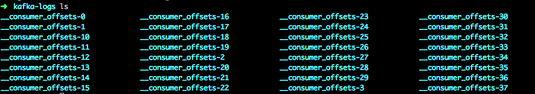

[TOC]

## 一、GroupCoordinator 概念

GroupCoordinator是运行在Broker上的一个服务，用来管理Consumer Group的member和offset。broker在启动的时候会启动一个GroupCoordinator实例。但是一个集群可能有多个broker，怎么确定一个新的Consumer Group要和哪个broker上的GroupCoordinator交互呢？这就和kafka上的一个topic `__consumer_offsets`有关系了。

### \_\_consumer_offsets

consumer_offsets是kafka内部使用的一个topic，专门用来存储group消费的情况，默认情况下，这个topic有50个partition，每个partition有3个副本。我们进入某个broker的日志目录，一般都能看到对应的partition目录，如下图：



### Consumer Group如何找到对应的GroupCoordinator

\_\_consumer_offsets会分布在各个broker，当一个新的Consumer Group要寻找和它交互的GroupCoordinator时，需要先对它的GroupId进行hash，然后取模\_\_consumer_offsets的partition数量，最后得到的值就是对应partition，接着找到这个partition的leader所在的broker就是我们要交互的broker了。公式如下：

```java
abs(GroupId.hashCode()) % NumPartitions
```

NumPartitions为\_\_consumer_offsets的数量。GroupId为初始化Consumer时指定的groupId。

举个例子，假设一个GroupId的hashcode是5，之后取模50得到5。接着partition-5的leader所在的broker就是我们要找的那个节点。这个Group后面都会直接和该broker上的GroupCoordinator交互。

## 二、Consumer加入Group流程

consumer在拉取数据之前，必须加入某个group，在consumer加入到group的整个流程中，主要涉及到了3种请求：

- GROUP_COORDINATOR请求
- JOIN_GROUP请求
- SYNC_GROUP请求

### GROUP_COORDINATOR请求

前面我们知道了通过\_\_consumer_offsets和对应的公式可以算出要和哪台broker上的GroupCoordinator做交互，但是我们并不知道\_\_consumer_offsets的各个partition位于哪些broker上。比如我们通过公式算出了要和\_\_consumer_offsets的partition-5所在的broker做交互，但是我们不知道它的partition-5在哪个broker上。**因此我们需要先随便往集群的一个broker发送一个GROUP_COORDINATOR请求来获取对应的brokerId。**

要往哪个broker发送GROUP_COORDINATOR请求也不是随机选择的，kafka会默认选择一个当前连接数最少的broker来发送该请求。这个连接数是指**inFightRequest**，也就是当前客户端发往broker还未返回的那些请求数量。

**broker处理：**

kafka的broker接收到GROUP_COORDINATOR请求后，会通过公式`abs(GroupId.hashCode()) % NumPartitions`算出对应的partition，然后搜索__consumer_offsets的metadata，找到该partition leader所在的brokerId，最后返回给客户端。

这里要注意两点：

1. 如果用户初始化KafkaConsumer的时候没有指定GroupId，broker接收GROUP_COORDINATOR请求拿到的groupId值就是"",最后解析出来的partition就是0，broker会返回parition-0的leader所在的brokerId。
2. 如果__consumer_offsets被删除了或者还未创建，broker找不到对应的metadata时，会自动创建一个新的topic然后再查找对应的brokerId。

### JOIN_GROUP请求

找到要交互的broker后，客户端就会往该broker发送 JOIN_GROUP请求了。

 JOIN_GROUP请求主要是让consumer加入到指定的group中，broker上的GroupCoordinator服务会管理group的各个members(对应consumer)。

broker收到 JOIN_GROUP请求后，让目标group进入 **PreparingRebalance**状态，然后返回一些信息，这些信息包括consumer在group中对应的memberId以及该group的leaderId、generationId等等，如果对应consumer是leader，那么还会将当期组中所有的members信息返回给leader用于后面让leader来分配各个member要消费的partition（第一个加入该group的consumer就是该group的leader）。

客户端收到broker返回的信息后，如果没有错误则表示已经加入到该Group中了。接着继续发送SYNC_GROUP请求。

另外，broker处理JOIN_GROUP请求的过程还有很多细节需要介绍，后面我会结合group状态的变更来具体介绍。

### SYNC_GROUP请求

前面的JOIN_GROUP请求只是加入目标group，并没有获取到要消费的partition是哪些。SYNC_GROUP请求就是用于获取consumer要消费哪些partition用的。

consumer根据JOIN_GROUP请求的返回值，判断自己是否是leader，如果是leader，就当场获取group中的所有members然后使用PartitionAssignor的实现来为group中的各个member分配要消费哪些partition，接着把这些信息封装成SYNC_GROUP请求发送给broker。

如果consumer是follower，就直接发送一个SYNC_GROUP请求给broker。

broker收到SYNC_GROUP请求后，根据group中的leader给的分配信息在内存中给每个member分配对应的partiton，然后将这些信息返回给对应的consumer。

最后，各个group中的consumer就得到了自己要消费的partition，就可以开始拉取数据了。

## 三、Group的状态变更


没传groupId时，GROUP_COORDINATOR请求会返回parition-0的broker给客户端。然后客户端要加入group时会校验groupId，这时候没传会报错。

`org.apache.kafka.common.errors.InvalidGroupIdException: The configured groupId is invalid`

### 