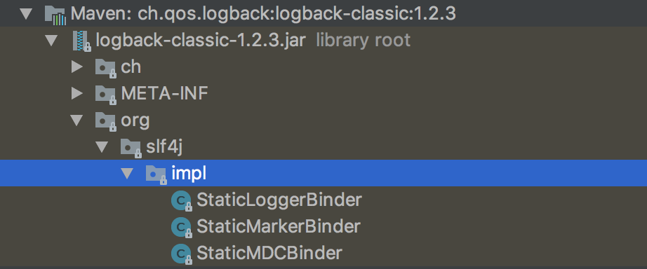
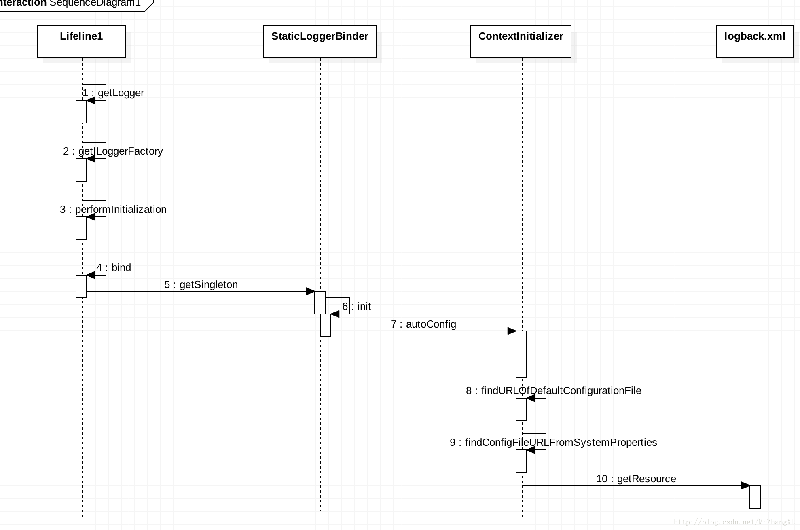

logback是java的日志开源组件，是log4j创始人写的，性能比log4j要好，目前主要分为3个模块

1. logback-core:核心代码模块
2. logback-classic:log4j的一个改良版本，同时实现了`slf4j`的接口，这样你如果之后要切换其他日志组件也是一件很容易的事
3. logback-access:访问模块与Servlet容器集成提供通过Http来访问日志的功能

本篇博客会讲解logback的使用、配置详解、以及logback简单的一个原理。

## 一、logback的使用  

引入maven依赖

```xml
<!--这个依赖直接包含了 logback-core 以及 slf4j-api的依赖-->
<dependency>
     <groupId>ch.qos.logback</groupId>
     <artifactId>logback-classic</artifactId>
     <version>1.2.3</version>
</dependency>
```

然后就可以直接在代码中使用slf4j的接口获取Logger输出日志了。（配置在下面的章节介绍）

```java
//这是slf4j的接口，由于我们引入了logback-classic依赖，所以底层实现是logback
private static final Logger LOGGER = LoggerFactory.getLogger(Test.class);

public static void main(String[] args) throws InterruptedException {
    LOGGER.info("hello world");
}
```

## 二、logback的配置  

### 配置获取顺序

logback在启动的时候，会按照下面的顺序加载配置文件   

1. 如果java程序启动时指定了` logback.configurationFile`属性，就用该属性指定的配置文件。如`java -Dlogback.configurationFile=/path/to/mylogback.xml Test` ，这样执行Test类的时候就会加载/path/to/mylogback.xml配置
2. 在classpath中查找  **logback.groovy** 文件
3. 在classpath中查找  **logback-test.xml** 文件
4. 在classpath中查找  **logback.xml** 文件
5. 如果是 jdk6+,那么会调用ServiceLoader 查找 com.qos.logback.classic.spi.**Configurator**接口的第一个实现类
6. 自动使用**ch.qos.logback.classic.BasicConfigurator**,在控制台输出日志 

上面的顺序表示优先级，使用java -D配置的优先级最高，只要获取到配置后就不会再执行下面的流程。相关代码可以看`ContextInitializer#autoConfig()`方法。

### 关于SLF4j的日志输出级别  

在slf4j中，从小到大的日志级别依旧是`trace、debug、info、warn、error`。

### logback.xml 配置样例  

```xml
<?xml version="1.0" encoding="UTF-8"?>
<configuration debug="true" scan="true" scanPeriod="1 seconds">

    <contextName>logback</contextName>
    <!--定义参数,后面可以通过${app.name}使用-->
    <property name="app.name" value="logback_test"/>
    <!--ConsoleAppender 用于在屏幕上输出日志-->
    <appender name="stdout" class="ch.qos.logback.core.ConsoleAppender">
        <!--定义了一个过滤器,在LEVEL之下的日志输出不会被打印出来-->
        <!--这里定义了DEBUG，也就是控制台不会输出比ERROR级别小的日志-->
        <filter class="ch.qos.logback.classic.filter.ThresholdFilter">
            <level>DEBUG</level>
        </filter>
        <!-- encoder 默认配置为PatternLayoutEncoder -->
        <!--定义控制台输出格式-->
        <encoder>
            <pattern>%d [%thread] %-5level %logger{36} [%file : %line] - %msg%n</pattern>
        </encoder>
    </appender>

    <appender name="file" class="ch.qos.logback.core.rolling.RollingFileAppender">
        <!--定义日志输出的路径-->
        <!--这里的scheduler.manager.server.home 没有在上面的配置中设定，所以会使用java启动时配置的值-->
        <!--比如通过 java -Dscheduler.manager.server.home=/path/to XXXX 配置该属性-->
        <file>${scheduler.manager.server.home}/logs/${app.name}.log</file>
        <!--定义日志滚动的策略-->
        <rollingPolicy class="ch.qos.logback.core.rolling.TimeBasedRollingPolicy">
            <!--定义文件滚动时的文件名的格式-->
            <fileNamePattern>${scheduler.manager.server.home}/logs/${app.name}.%d{yyyy-MM-dd.HH}.log.gz
            </fileNamePattern>
            <!--60天的时间周期，日志量最大20GB-->
            <maxHistory>60</maxHistory>
            <!-- 该属性在 1.1.6版本后 才开始支持-->
            <totalSizeCap>20GB</totalSizeCap>
        </rollingPolicy>
        <triggeringPolicy class="ch.qos.logback.core.rolling.SizeBasedTriggeringPolicy">
            <!--每个日志文件最大100MB-->
            <maxFileSize>100MB</maxFileSize>
        </triggeringPolicy>
        <!--定义输出格式-->
        <encoder>
            <pattern>%d [%thread] %-5level %logger{36} [%file : %line] - %msg%n</pattern>
        </encoder>
    </appender>

    <!--root是默认的logger 这里设定输出级别是debug-->
    <root level="trace">
        <!--定义了两个appender，日志会通过往这两个appender里面写-->
        <appender-ref ref="stdout"/>
        <appender-ref ref="file"/>
    </root>

    <!--对于类路径以 com.example.logback 开头的Logger,输出级别设置为warn,并且只输出到控制台-->
    <!--这个logger没有指定appender，它会继承root节点中定义的那些appender-->
    <logger name="com.example.logback" level="warn"/>

    <!--通过 LoggerFactory.getLogger("mytest") 可以获取到这个logger-->
    <!--由于这个logger自动继承了root的appender，root中已经有stdout的appender了，自己这边又引入了stdout的appender-->
    <!--如果没有设置 additivity="false" ,就会导致一条日志在控制台输出两次的情况-->
    <!--additivity表示要不要使用rootLogger配置的appender进行输出-->
    <logger name="mytest" level="info" additivity="false">
        <appender-ref ref="stdout"/>
    </logger>
    
    <!--由于设置了 additivity="false" ，所以输出时不会使用rootLogger的appender-->
    <!--但是这个logger本身又没有配置appender，所以使用这个logger输出日志的话就不会输出到任何地方-->
    <logger name="mytest2" level="info" additivity="false"/>
</configuration>
```

### 配置详解  

#### configuration节点相关属性  

| 属性名称   | 默认值    | 介绍                                                         |
| ---------- | --------- | ------------------------------------------------------------ |
| debug      | false     | 要不要打印 logback内部日志信息，true则表示要打印。建议开启   |
| scan       | true      | 配置发送改变时，要不要重新加载                               |
| scanPeriod | 1 seconds | 检测配置发生变化的时间间隔。如果没给出时间单位，默认时间单位是毫秒 |

#### configuration子节点介绍 

##### 1. contextName节点 

设置日志上下文名称，后面输出格式中可以通过定义 %contextName 来打印日志上下文名称

##### 2.property节点  

用来设置相关变量,通过key-value的方式配置，然后在后面的配置文件中通过 ${key}来访问

##### 3.appender 节点   

日志输出组件，主要负责日志的输出以及格式化日志。常用的属性有name和class
| 属性名称 | 默认值   | 介绍                                                         |
| -------- | -------- | ------------------------------------------------------------ |
| name     | 无默认值 | appender组件的名称，后面给logger指定appender使用             |
| class    | 无默认值 | appender的具体实现类。常用的有 ConsoleAppender、FileAppender、RollingFileAppender |

**ConsoleAppender**：向控制台输出日志内容的组件，只要定义好encoder节点就可以使用。

**FileAppender**：向文件输出日志内容的组件，用法也很简单，不过由于没有日志滚动策略，一般很少使用

**RollingFileAppender**：向文件输出日志内容的组件，同时可以配置日志文件滚动策略，在日志达到一定条件后生成一个新的日志文件。

appender节点中有一个子节点`filter`，配置具体的过滤器，比如上面的例子配置了一个内置的过滤器ThresholdFilter，然后设置了level的值为DEBUG。这样用这个appender输出日志的时候都会经过这个过滤器，日志级别低于DEBUG的都不会输出来。

在RollingFileAppender中，可以配置相关的滚动策略，具体可以看配置样例的注释。

##### 4.logger以及root节点  

root节点和logger节点其实都是表示`Logger`组件。个人觉的可以把他们之间的关系可以理解为父子关系，root是最顶层的logger，正常情况getLogger("name/class")没有找到对应logger的情况下，都是使用root节点配置的logger。

如果配置了logger，并且通过getLogger("name/class")获取到这个logger，输出日志的时候，就会使用这个logger配置的appender输出，同时还会使用rootLogger配置的appender。我们可以使用logger节点的`additivity="false"`属性来屏蔽rootLogger的appender。这样就可以不使用rootLogger的appender输出日志了。

关于logger的获取，一般logger是配置name的。我们再代码中经常通过指定的CLass来获取Logger，比如这样`LoggerFactory.getLogger(Test.class);`,其实这个最后也是转成对应的包名+类名的字符串`com.kongtrio.Test.class`。假设有一个logger配置的那么是`com.kongtrio`，那么通过`LoggerFactory.getLogger(Test.class)`获取到的logger就是这个logger。

也就是说，name可以配置包名，也可以配置自定义名称。

> 上面说的logger和root节点的父子关系只是为了方便理解，具体的底层实现本人并没有看，他们之间真正的关系读者有兴趣的话可以去看logback的源码

### 一些特性的支持  

在看logback的启动日志时，看到下面这句话。

`no applicable action for [totalSizeCap], current ElementPath  is [[configuration][appender][rollingPolicy][totalSizeCap]]` 

`no applicable action for [maxFileSize], current ElementPath  is [[configuration][appender][rollingPolicy][maxFileSize]]` 

大概意思解析logbck配置时不支持totalSizeCap、maxFileSize的配置。后来查了下，果然，totalSizeCap是在1.1.6之后的版本才开始支持的，切换到1.1.7之后就不会出现这句话了。

maxFileSize比较奇怪，试了目前所有的版本都不支持rollingPolicy—maxFileSize的配置方案，如果配置到triggeringPolicy节点下，又是可以生效的。但是官网给的文档上又有出现rollingPolicy下面的。

> Ps:启动的时候建议多看看日志，可以及早发现一些问题。比如这些配置没生效，看到这些日志就可以马上调整，而不会因为没达到预期的效果而造成一些损失。

## 三、实现原理  

### slf4j是什么  

slf4j只是一套标准，通俗来讲，就是定义了一系列接口，它并不提供任何的具体实现。所以，我们使用这套接口进行开发，可以任意的切换底层的实现框架。

比如，一开始项目用的是log4j的实现，后来发现log4j的性能太差了，想换成logback，由于我们代码中都是面向slf4j接口的，这样我们只要吧log4j的依赖换成logback就可以了。

### logback-classic启动原理

我们在调用`LoggerFactory.getLogger(Test.class)`时，这些接口或者类都是slf4j的，那么，它是怎么切换到logback的实现的呢？

为了解决这个问题，我追踪了一下代码，发现logback-classic底下，有一个slf4j的包.



slf4j在初始化时会调用`org.slf4j.StaticLoggerBinder`进行初始化。因此，每个要实现slf4j的日志组件项目，底下都要有`org.slf4j.StaticLoggerBinder`的具体实现。这样slf4j才会在初始化的关联到具体的实现。

比如logback在自己定义的StaticLoggerBinder做了自己组件的初始化工作。下面是网上找的一个时序图：



### 多个依赖包都实现了slf4j 

如果引入了多个slf4j的实现依赖包，那么各个包底下都有`org.slf4j.StaticLoggerBinder`的实现，这时候slf4j会调用哪个包的StaticLoggerBinder实现呢？

这个问题和java的类加载机制有关系，在双亲委派机制的模型中，这些引入的依赖包通常都是由`Application ClassLoader`来加载的。`Application ClassLoader`会加载用户路径(classpath)上指定的类库，如果多个`org.slf4j.StaticLoggerBinder`的jar包实现，类加载器先扫到哪个jar包，就会使用jar包提供的实现。

举个例子，我们通过 `java -classpath a.jar:b.jar Test`运行Test类，a.jar和b.jar都定义了`org.slf4j.StaticLoggerBinder`的实现，那么执行Test时加载StaticLoggerBinder类就会加载a.jar中的那个定义类。因为a.jar在classpath中排在比较前面。

## 四、总结  

日志组件的使用一般都非常简单，几乎所有的项目中都会用到各种各样的日志组件。但是可能就是由于太简单了，比较少的人会愿意深入系统的去了解。本人也只是对logback的配置以及一些简单的原理做了一些了解，并没有很深入的去看logback的具体实现。

因此，本文的内容大部分都是基于官网的文档以及网上一些其他关于logback的博客，虽然也做了一些简单的测试，但并不保证全部都是正确的。