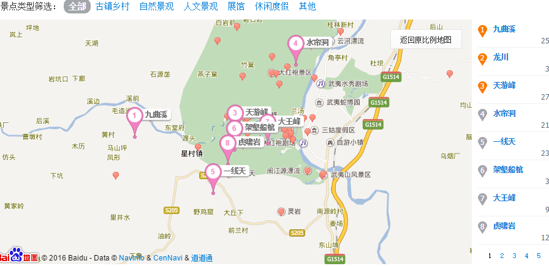

[TOC]

## 武夷山旅游计划  
### 旅游季节  
> 游览武夷山的最佳季节是夏季。     
> 夏季虽然气温偏高，却是万物生长最为茂盛、武夷风光最具特色之时，此时去是最好不过的。武夷山最热的月份是7月，如果选这个时候去旅游的话，切记中午12点到下午3点之前在酒店休息，室外十分炎热，且可以遮挡的地方不多。因为夏天天黑的很迟，所以就算下午3点出去旅游也不迟。
> 到了9月中旬，此时是淡季，游人相对要少，气候也适宜。如果想在九曲溪上漂流的话，最好在不冷不热的10月、11月前往。    
> 武夷山四季温和湿润，年均温度17.6℃。一般说来，一年四季都适宜游武夷山，但冬季山景萧条，自然风光大打折扣。  

### 旅行装备

> 1、 如果选择夏天（7、8月）来武夷山一定要涂摸防晒霜（高倍的），护肤品 SPF30以上防水性好的防晒露；晒后镇定修护露；保湿喷雾反复涂摸，尤其是安排漂流的时候特别需要。
> 2、 一定要带：太阳镜、防紫外线太阳伞。
> 3、 夏天的话拖鞋最好都带上，碰到下午漂流的话会觉的特别的好用。替换衣裤（多备几套，衣物要带吸汗的、透气、快干的衣服当地不容易干）武夷山的气温全年平均在18度左右，所以各位去的话带点夏天的衣服就可以了，以防万一的话带件单外套或长袖衬衫的话足够了。
> 4、 随身药物：止泻药（怕水土不服吃不习惯）、防中暑人丹、晕车药、感冒药、止痛药、邦迪；还有就是蚊不叮等防蚊虫叮咬的药水等啦。
> 5、 准备一个小的手电筒，到武夷山旅游一线天的时候就有用了。里面比较黑，通常需要用到，而里面也有出租的。

### 交通  

搭车去武夷山高铁东站,可搭K1到武夷山风景区(高德地图显示一个小时左右就能到,去高铁北站可以搭7路车,但是经过的站点比较多,所以比K1要慢很多,因此选择去东站搭K1比较适合)。

> K1路（高铁武夷山东站——三木自游小镇）全程一票制10元（自动投币）
> 1、停靠站点：上行：高铁武夷山东站→航天体验馆→香江茗苑（仙店工业园区）→南源岭→景区南入口→三木自游小镇
> 下行：三木自游小镇→旅游局→太阳城→景区南入口→南源岭→香江茗苑（仙店工业园区）→航天体验馆→高铁武夷山东站
> 2、首末班时间：
> 高铁武夷山东站 首班：08:15 末班：22:35
> 三木自游小镇 首班：06:20 末班：19:40  

在美团有好几家酒店在武夷山风景区南门附近,有一家彬晨酒店看起来不错,每晚100不到,可以搭K1到南源岭下车然后步行过去。

到时搭K1回去也可以直接搭K1去高铁东回厦门。  

### 游玩计划  

#### 启程: 
下午3点请假出发去厦门北站,搭17:06分的动车,20:03分到武夷山东站,然后搭K1去客栈，预计9点半-10点到达客栈。整理一下然后可以去客栈周边逛逛或者直接洗澡睡觉。  

#### 第一天:  

**早上:**7点起床,洗漱吃完早饭后搭公交K1去武夷山景区南门站，然后搭景区内游览车(免费)去武夷山景区北门。先去水帘洞玩一下。攻略建议游玩时间1-2小时。然后做车去爬天游峰。攻略建议游玩2-3个小时。所以差不多爬到12点那里，然后随便找个地方吃下午饭(面包)。  

**下午:**吃完午饭坐景区观光车出发前往玉女峰。攻略建议游玩时间1-2个小时。之后再步行前往虎啸岩。攻略建议游玩时间15-30分钟。然后再一路前往一线天，攻略建议游玩时间1-2个小时。下午基本旅程就基本结束。然后坐车去印象大红袍景点附近吃饭游玩逛街。

**晚上:**印象大红袍8点开始。7点半进场。预计要演75分钟那里。看完大红袍回酒店，可以再去逛逛街。

**第一天游览路线**:水帘洞——>天游峰——>玉女峰——>虎啸岩——>一线天——>印象大红袍

#### 第二天:

早上:8点起床，洗漱吃完早饭去景区坐九曲溪竹筏。攻略建议游玩时间是2-3个小时。然后下来吃午饭

下午:前往武夷宫景区观光一下。差不多玩1,2个小时准备收拾行李去动车站。

**第二天游览路线**:九曲溪竹筏——>武夷宫景区

#### 回程　　

去武夷山东站搭17点44分的动车回厦门北。晚上8点57分达到厦门北站。

### 重要电话  

> 政府呼叫中心：0599-5131890
> 旅游纠纷投诉：0599-5250660
> 旅游质量投诉：0599-5250609
> 民航站售票处：0599-5303557
> 火车站问讯处：0599-5239366
> 汽车站问讯处：0599-5311446

### 出行须知  

1、风景区内的餐馆如果没有明确标价的一定记住要砍价，即使有标价的，如果觉得价格太贵，也可以谈价。
2、武夷山景区内的交通不是很方便，景区的马路上有各种车辆，有时候还能看到拖拉机，也许可以顺便搭搭车。
3、去景区之前计划好自己要去的地方，最好不要选择导游，一般导游都是带去门票比较贵，景点风景一般的。建议慎重选择。
4、在景区请导游、包车前，一定要多问几个，货比三家再做决定。
5、不要食用国家保护的动植物，即使有人拉你去吃，也还应该以洁身自好为上。
6、包车司机或导游带去吃饭的餐馆通常价格会高一些，记得还价或自己找地方吃。
7、吃套餐比点菜实惠，就算是吃套餐也可以先看菜单，把不喜欢的换成喜欢的。
8、风景区内的小吃很便宜，紫溪粉有点象加粗的桂林米粉。
9、保护区里只有桐木村附近才有地方吃饭，最好自带干粮，不然就一定要狠狠砍价。

###　景点介绍  　　

#### 水帘洞

​	水帘洞是福建省武夷山最大的洞穴，高、宽各一百多米。洞顶斜覆而出，宛如一道飞檐，遮住了半边天。洞门前终年流淌的两股清泉，从一百多米高的岩顶飞泻而下，微风过处，水珠摇曳分合，随风飘洒，仿佛天女散花，又如悬挂的两幅珠帘。正是“赤壁千寻晴拂雨，明珠万颗画垂帘。”隔帘望去，洞外的茶园竹丛，村落人家，一片迷蒙，宛如一幅诗意朦胧的山水画，别有一番韵致。
​	水帘洞内，轩爽敞亮，可容数百人。岩壁上摩崖石刻比比皆是，“活源”两字最为著名。沿崖建有奉祀宋朝大儒刘子?、朱熹、刘珙的三贤祠和奉祀孔子、老子、释迦牟尼的三教堂和清微洞真观。
出了洞口，磴道的右侧，就是碧绿沉翠的浴龙池。水帘泻入池中，不断溅起水花，随即又晃漾出一圈圈涟漪，煞是好看。远望可见大幅石刻“自古晴檐终日雨，春秋花月一帘珠。”与瀑布相映成趣。

#### 天游峰  	  
​	[天游峰](http://lvyou.baidu.com/tianyoufeng)是[武夷山](http://lvyou.baidu.com/wuyishan)景区的精华景点之一，海拔不高，但登顶的道路却一点也不轻松，有的路段不仅陡峭而且还狭窄，天游峰的终点是天游观，但还不是最高处，最高处是一个气象站，出了一座房屋和一台发电机外看不到什么，但是天游观那里风光的确无限好，可以俯瞰[九曲溪](http://lvyou.baidu.com/jiuquxi)和游动的竹排，以及武夷山景区的丹霞地貌，如同在画中一样。登天游峰最好选择在上午，因为背光，下午的话全程基本面光拍摄，拍不出好照片。节假日和黄金周的旅游旺季这个景点人非常多，可见天游峰的人气之高。所以喜欢自助游的朋友尽量选择错开高峰期来这里。上山最好多带几瓶水  

#### 玉女峰  

​	[武夷山](http://lvyou.baidu.com/wuyishan)的标志性山峰之一，与大王峰隔河相望，所以就有了一段神话故事来烘托。玉女峰在武夷山地位很神圣，没有登顶道路，要不然就不叫“玉女”了。在[九曲溪](http://lvyou.baidu.com/jiuquxi)漂流时，以及在从南门去往[天游峰](http://lvyou.baidu.com/tianyoufeng)、虎啸岩、一线天的路上都能看到玉女峰，但在九曲溪漂流时才能看见玉女峰最形象的角度，其他的角度看起来就像个脚掌一样。

#### 虎啸岩	  

​	虎啸岩位于二曲溪南，怪石崔嵬，流水迂回，是一个独具泉石天趣的佳境。“虎溪灵洞”4个大字高勒于岩上。蟠踞在一线天北面，相传曾有仙人骑虎吼啸其上，故名。“虎啸”之声，来自岩上的一个巨洞，山风穿过洞口，便发出怒吼，声传空谷，震撼群山。主要景点有天成禅院和虎啸八景。天成禅院建在虎啸岩的悬崖下，这里千仞悬崖向外斜覆，形成一个巨大的洞府，整座禅院不施片瓦，风雨不侵。虎啸八景为白莲游、集云关、坡仙带、普门兜、法雨悬河、语儿泉、不浪舟和宾曦洞。在武夷，一岩而兼有群峰之胜的，唯有虎啸。所以，虎啸岩可说是一处"极目皆图画"的佳境。

#### 一线天  

​	一线天， 一线天 又名灵岩，位于武夷群峰的西南端，是武夷的最奇的岩洞，素有“鬼斧神工之奇”的称号。一线天，存在在[九曲溪](http://lvyou.baidu.com/jiuquxi)二曲南面的一个幽邃的峡谷中。里面一座巍然挺立的巨石，从伏羲洞而入岩内，到了深处，抬头仰望，但见岩顶裂开一罅，就像是利斧劈开一样，相去不满一尺，长约一百多米，从中漏进天光一线，宛如跨空碧虹，这就是令人叹为观止的一线天。  

#### 印象大红袍

​	《印象大红袍》山水实景演出由[张艺谋](http://baike.baidu.com/view/3706.htm)、王潮歌、樊跃共同组成的“印象铁三角”领衔导演，是他们继《印象刘三姐》、《印象丽江》、《印象西湖》、《印象海南岛》后创作的第五个印象作品，也是以双世遗产地——武夷山为地域背景，以武夷山茶文化为表现主题的大型实景演出。

#### 九曲溪  

​	九曲溪是武夷山脉主峰——黄岗山西南麓的溪流，位于福建省武夷山峰岩幽谷之中。因有三弯九曲之胜，故名为九曲溪。 福建省闽中山水奇秀以武夷山为第一，而武夷之魂在九曲溪，九曲溪澄澈清莹，盈盈一水，折为九曲。九曲景色各不相同，两岸林木葱郁，煞是迷人。主要有：大王峰、仙钓台、武夷精舍等山石人文景观。可坐古朴竹筏在九曲漂流，赏盈盈景色。武夷山九曲溪两岸的峭壁上，有悬棺遗迹十余处。白岩和观音岩保存完保存完好的两具船棺距今有三千多年，随葬的龟形木盘是具有商周青铜文化特征的遗物。 一曲就在九曲溪的最下游，景色畅旷豁达，附近有大王峰、幔亭峰、狮子峰和观音岩。二曲是一段幽深险峭的峡谷，武夷36峰中最迷人的玉女峰就在二曲西侧。三曲南崖的小藏峰有闻名于世的“架壑船棺”。四曲胜景是隔溪对峙的两座巍巍巨岩，东为在藏峰，西为西钓台。五曲是九曲中最为开阔的地方，这里有葱茏林木的平林洲，洲上有隐屏峰、接笋峰，玉华峰等名峰。隐屏峰下有著名的紫阳书院，是南宋理学家朱熹讲学处。六曲是九曲溪中最短的一曲，但其景色又为最胜，被称为“武夷山第一胜地”的天游峰即在此。七曲其北岸有武夷山风景区最高峰——三仰峰，海拔754米。八曲水天空阔，碧水中怪石争奇斗巧，有上水狮石、下水龟石等石景。九曲尽头是星村，放眼四望，平畴沃野，豁然开朗。

#### 武夷宫  

​	武夷宫又名会仙观、冲佑观、万年宫，在福建省崇安县南约十五公里处的武夷山大王峰南麓，前临九曲溪口，是历代帝王祭祀武夷神君的地方，也是宋代全国六大名观之一。武夷宫是武夷山景区的门户，位九曲溪口，是武夷山风景区最古老的道观。现存两口龙井和万年宫、三清殿。万年宫现在是朱熹纪念馆，宫内有两株千年桂树，龙盘蛇曲，被称为“桂花王”。三清殿现在是国际兰亭学院所在地，殿内有四块珍贵的碑刻：忠定神道碑、洞天仙府、明龚一清和现代郭沫若游武夷的诗题。 　

### 地图  

<http://lvyou.baidu.com/wuyishan/ditu/>

